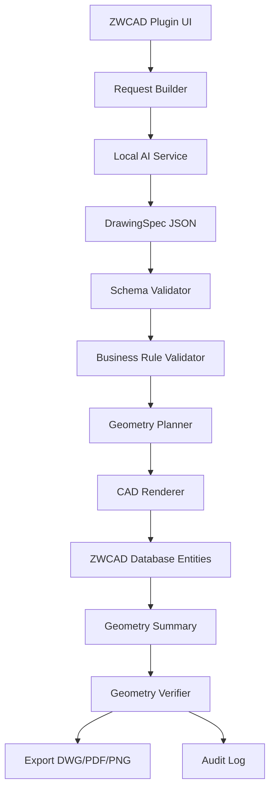

# Architecture

## Target Architecture

## Module Boundaries

| Module | Owns | Must Not Own |
|---|---|---|
| `ZwcadAiPlugin` | CAD commands, panel, ZWCAD document lock/transaction adapter, user confirmation | AI prompt internals, arbitrary model repair logic |
| `ZwcadAi.Core` | DrawingSpec models, validation result types, domain errors | ZWCAD runtime references |
| `ZwcadAi.Renderer` | Spec planning, writer transaction policy, render result contracts | Natural language interpretation, direct ZWCAD runtime references |
| `ZwcadAi.AiService` | Model calls, prompt versioning, structured output, retry | Direct DWG mutation |
| `ZwcadAi.Tests` | Unit tests, regression samples, geometry snapshots | Production secrets |
| `templates` | Layer, dimension, text style, blocks, title blocks | Runtime business logic |

## Recommended Technology Split

- CAD 插件：ZRX.NET 优先，目标是降低维护成本并利用 .NET 类型系统。
- AI 服务：本地 HTTP 服务或插件内部服务适配层，负责模型调用和输出修复。
- 协议：DrawingSpec v1 JSON Schema。
- 校验：Schema 校验 + 业务规则校验 + 几何校验。
- 导出：优先使用 ZWCAD 内部能力导出 DWG/PDF，PNG 可作为后续预览增强。

## Command Surface

| Command | Purpose | MVP Requirement |
|---|---|---|
| `AIDRAW` | 打开 AI 绘图面板并生成新图形 | 必须 |
| `AICHECK` | 校验当前图形或上次生成结果 | 必须 |
| `AIEXPORT` | 导出 DWG/PDF 和校验报告 | 必须 |
| `AISETTINGS` | 配置模型服务、模板、图层标准 | 建议 |
| `AIHISTORY` | 查看历史请求和生成记录 | 后续 |

## Data Flow

1. 用户输入自然语言或参数。
2. 插件补齐上下文：单位、模板、允许实体、企业标准、当前选择集。
3. AI 服务返回 DrawingSpec 或澄清问题。
4. 插件执行 JSON Schema 校验。
5. 插件执行业务规则校验，例如尺寸范围、图层标准、实体数量限制。
6. 插件生成预览摘要并等待用户确认。
7. CAD-facing writer 在单个 DocumentLock + Transaction 中创建实体。
8. 插件提取几何摘要并复核。
9. 插件保存审计记录并按需导出。

## Error Handling

| Failure | Expected Behavior |
|---|---|
| 模型超时 | 显示超时原因，允许重试，不修改 DWG |
| JSON 非法 | 尝试结构化修复一次，仍失败则显示错误 |
| Schema 不通过 | 定位字段和实体 id，要求 AI 或用户修正 |
| 业务规则不通过 | 显示违反规则，不进入渲染 |
| 渲染异常 | 回滚事务，保留错误日志 |
| 导出失败 | 保留 DWG 状态，显示目标路径和原因 |
| 用户取消 | 不提交事务，不返回正式 `RenderedEntity` 映射 |

## Stability Rules

- 每个自动绘图命令必须创建独立 request id。
- 所有文件路径必须正规化并限制在允许目录或经用户确认。
- 模型输出不能被当作代码执行。
- 渲染器不能依赖 UI 焦点、命令行提示或窗口坐标。
- 单次请求必须设置实体数量、坐标范围和运行时间上限。
